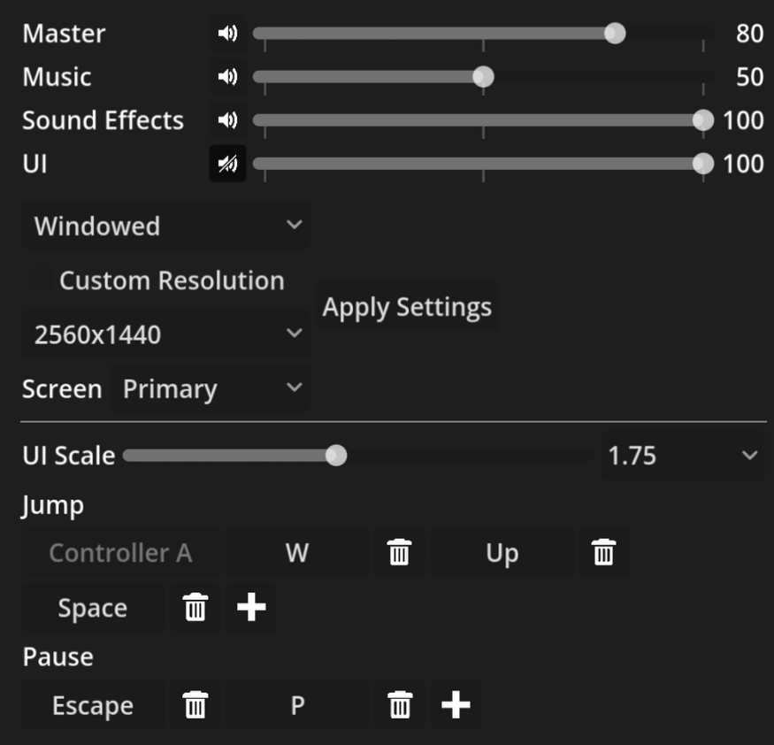

# SV Options Menu
Utilities for setting up an options menu in your Godot game. Currently
usable but still in an unpolished state, so you might need to wrangle
it to fit into your project.



## Installation
- SV Options Menu requires [Godot 4.7](https://godotengine.org/download/4.x)
- Clone the repository, then copy the `addons/sv_options_menu` folder
  into the addons folder of your own project.
- Activate the plugin in Project Settings.

## Usage
- Configure SV Options Menu by editing the newly created
  `options_config.tres` in your project root.
- For managed settings, place settings UI scenes from the addon's
  folders to your game's options menu.
- An example of usage is seen in the Godot project at the root of this
  repository.

## License
See the [LICENSE](./LICENSE) file. Note that this repo also contains
third party dev dependencies that have their own licenses. These can
be found in the following files:
```
addons/gdUnit4/LICENSE
```
